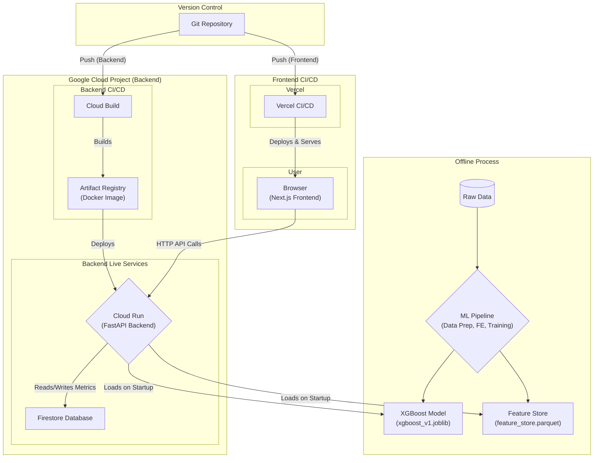

# Taktile Engine: A Visual Fraud Detection Sandbox

This project is a full-stack, interactive sandbox where you can build a fraud detection strategy and then watch it work in real-time.

You get to see the entire decision path light up as simulated transactions flow through the logic you've built. It's a great way to get an intuitive feel for how a complex decisioning system actually behaves.

---
## System Architecture Diagram

---
## What's Inside

The project is split into three main parts: a frontend to act as the command center, a backend to be the decision engine, and an ML pipeline.

### The Frontend
The frontend is a visual programming tool built with **Next.js** and **React Flow**. You drag & drop components-like features, models, and rules-onto a canvas, connect them into a decision graph, and hit run to see the simulation live.

### The Backend 
The backend is built with **FastAPI**. It takes the graph you built on the frontend and executes it for each incoming transaction. It then sends the final decision (`APPROVE`, `BLOCK`, `REVIEW`) and the path it took back to the UI so you can see it light up.

### The ML Pipeline
It's a set of scripts that take the raw transaction data, engineer useful features with **Pandas**, and then train an **XGBoost** model to predict fraud. The final model gets saved and used by the backend.

---
## The Data

The simulation runs on a realistic, synthetic dataset from the **[Fraud Detection Handbook](https://fraud-detection-handbook.github.io/)**. This gives us a solid playground of labeled fraudulent and legitimate transactions to test our strategies against.

---
## Getting Started

1.  **Run the ML Pipeline:** First, run the scripts in `backend/ml_pipeline` to generate the feature store and the trained model.
2.  **Start the Backend:** The backend is a containerized app. You can build and run it using the `Dockerfile` in the `backend` directory.
3.  **Start the Frontend:** In the `frontend` directory, run `npm install` and then `npm run dev`.

You should be able to open the app in your browser and start building.

